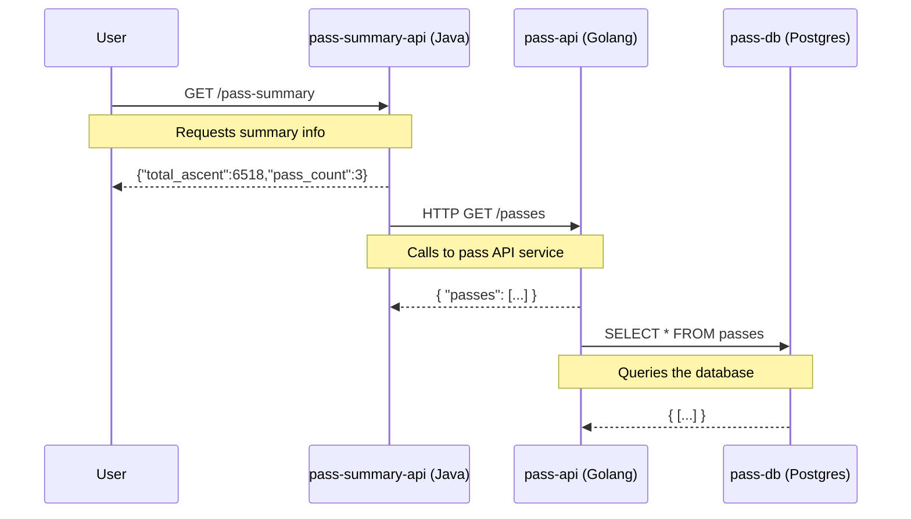

# Datadog Software Lifecycle Kubernetes Extravaganza

> [!IMPORTANT]  
> This repo is a WIP and not yet ready to publish. It is being shared in this state internally in order to solicit feedback from the rest of the Datadog pack. To this end the README contents are being drafted in [google docs](https://docs.google.com/document/d/15buq4OED_VnvwBYKxPEYT5aJ7PPrlLhL_kCZUiOBOpk/edit?usp=sharing)

This repo gives you a complete, cloneable, end-to-end demo of a golang/java stack hooked up to DataDog and Kubernetes. Rather than going service-by-service through a Kubernetes setup and then the Datadog integration, you can simply clone this repo, make some minor modifications to integrate into your environment, and get started. If you don’t intend to run it as it is, it also provides a complete reference for how the different pieces come together. 

## The Mountain Passes App 

The stack focusses on the _very important business_ of cataloging mountain passes. **pass-api** provides CRUD access to the underlying passes, storing a location, country, and total ascent for each, whilst **pass-summary-api** provides aggregate statistics over the top. Pass information is ultimately stored in a PostgreSQL database by the **pass-api**.

> [!IMPORTANT]
> To keep things simple, the PostgreSQL DB is a simple single container deployment, and is not setup for production-grade storage of important data!

Each application is instrumented with the Datadog APM library in order to emit traces into Datadog and provide runtime profiling. Logs are augmented with trace IDs to correlate them back to the requests they are triggered by. The required runtime metadata to support this can be seen in the corresponding application manifests:

|    Service     |      Deployment Manifest     |     Service    | 
| ---------------|------------------------------|----------------|
| **pass-api**   | [deployment.yaml](manifests/base/pass-api/deployment.yaml) | [pass-api](apps/pass-api/) | 
| **pass-summary-api** | [deployment.yaml](manifests/base/pass-summary-api/deployment.yaml) | [pass-summary-api](apps/pass-summary-api/) | 
| **pass-db**    | [deployment.yaml](manifests/base/db/deployment.yaml) | n/a | 

## The Datadog Software Development Lifecycle View
TODO
