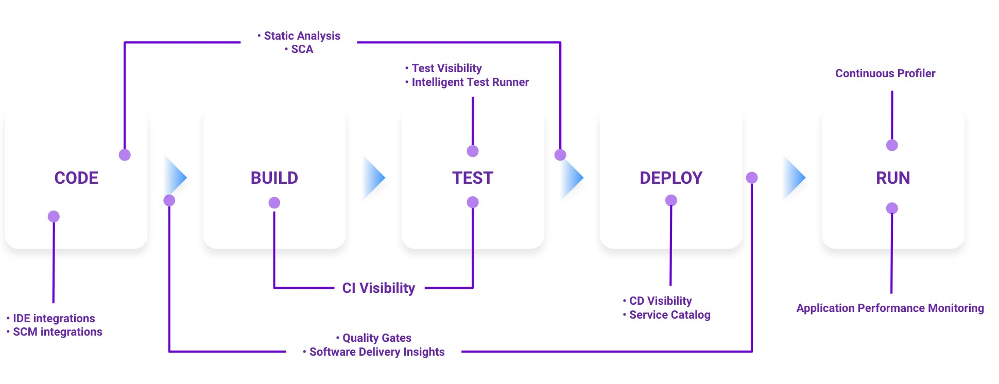

# Datadog Software Lifecycle GitOps demo

This repo gives you a complete, cloneable, end-to-end demo of a golang/java stack hooked up to Datadog and Kubernetes. Rather than going service-by-service through a Kubernetes setup and then the Datadog integration, you can simply clone this repo, make some minor modifications to integrate into your environment, and get started. If you don’t intend to run it as it is, it also provides a complete reference for how the different pieces come together. 

Want to get started with Datadog + end-to-end SDLC onto Kubernetes? You're in the right place.

### The Mountain Passes App 

The stack focusses on the _very important business_ of cataloging [mountain passes](https://en.wikipedia.org/wiki/Mountain_pass). Cycling and automotive enthusiasts have a shared passtime of travelling rapidly up and down these passes. Often-times halfway up a pass, a cyclist will find themselves in need of a good, robust, REST API cataloging important pass information. This project provides that API!

**pass-api** provides CRUD access to the underlying passes, storing a location, country, and total ascent for each, whilst **pass-summary-api** provides aggregate statistics over the top. Pass information is ultimately stored in a PostgreSQL database by the **pass-api**.

> [!IMPORTANT]
> To keep things simple, the PostgreSQL DB is a simple single container deployment, and is not setup for production-grade storage of important data!

Each application is instrumented with the Datadog APM library in order to emit traces into Datadog and provide runtime profiling. Logs are augmented with trace IDs to correlate them back to the requests they are triggered by. The required runtime metadata to support this can be seen in the corresponding application manifests:

|    Service     |      Deployment Manifest     |     Service    | 
| ---------------|------------------------------|----------------|
| **pass-api**   | [deployment.yaml](manifests/base/pass-api/deployment.yaml) | [pass-api](apps/pass-api/) | 
| **pass-summary-api** | [deployment.yaml](manifests/base/pass-summary-api/deployment.yaml) | [pass-summary-api](apps/pass-summary-api/) | 
| **pass-db**    | [deployment.yaml](manifests/base/db/deployment.yaml) | n/a | 

### Software Development Lifecycle View

This application integrates with the Datadog software development lifecycle services, starting from [code analysis](https://docs.datadoghq.com/code_analysis/static_analysis/) and moving up into runtime monitoring of the application using [application performance monitoring (APM)](https://www.datadoghq.com/product/apm/). 

The diagram below maps these services onto the development lifecycle:

    

As you work through the setup docs, you will be get a chance to play with each of these services in the context of a complete application.

### Getting Started

> [!TIP]  
> To complete this guide you'll need a **Kubernetes cluster** with **ArgoCD** running, as well as access to a **Datadog account**. We suggest getting started 
> locally with [Minikube](https://minikube.sigs.k8s.io/), the [ArgoCD single manifest deployment](https://argo-cd.readthedocs.io/en/stable/getting_started/), and a [free Datadog trial](https://www.datadoghq.com/free-datadog-trial/); this will let you test things out in isolation on your own machine. 

Although you don’t need a Datadog account to use this stack, using one will provide visibility end-to-end visibility from the CI pipelines right through to the running application observability. You can sign up for a free 2-week trial [here](https://www.datadoghq.com/free-datadog-trial/)!

The documentation walks you through setting up the application, linking it to Datadog, and getting it running in your cluster using ArgoCD. When you're ready to go, you can start by [setting up a fork of the repository](docs/setup-fork.md)! 
