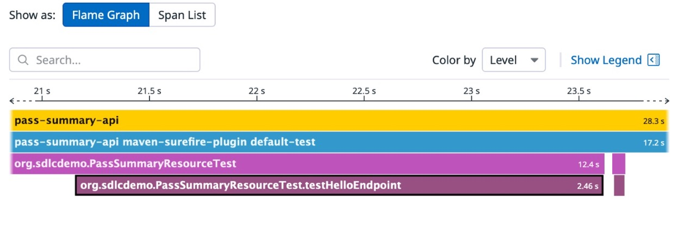

## Datadog: Development Lifecycle Visibility

Everything in the development lifecycle that happens before deployment  should now be visible in the Datadog console.

From the Datadog console, pressing cmd-k or ctrl-k opens the “Go To” dialog \- this makes it easy to jump to a particular pane of the console. For each of the sections below, you can use this dialog to jump where you need to go.

### Service Catalog

> [!TIP]
> Datadog Service Catalog provides a consolidated view of your services, combining ownership metadata, performance insights, security analysis, cost allocation, and much more. 

Let’s start by jumping over to the **Service Catalog**. You should see both services from our application have been discovered automatically now that Datadog has indexed the [service.datadog.yaml](..//service.datadog.yaml) manifest: 

    

This lets us track our services and their versions and changes throughout their lifecycle, as well as assign ownership for incident management and supporting metadata to them. 

> [!CAUTION]
> TODO - link here to more info about service catalog

### CI Visibility

> [!TIP]
> Datadog CI/CD Pipeline Visibility enables platform engineering and DevOps teams to monitor and improve the performance of their CI/CD pipelines.

Using the **Go To** dialog again, jump over to **CI Visibility**. From **Pipeline Executions**, you should immediately see the results of the builds that have run within your repository:

    

Clicking on **Main Autorelease**, we can quickly analyze the time spent building the containers \- selecting “Critical Path” shows us that **build-pass-api** is responsible for most of our build time:  

    

Why could this be? A hint can be found in the main-autorelease.yaml build file, and the platforms targeted for the Go build 🙂

> [!CAUTION]
> TODO - link here to more info about CI Vis

### Code Analysis

> [!TIP]
> Datadog Code Analysis evaluates your code for security, performance, best practices, and more without needing to executing the code. 

Using the **Go To** dialog, jump to **Code Analysis**. Code Analysis can be setup using a runner within your code pipelines, or on the Datadog side, with Datadog itself cloning and analyzing your repository.

The simplest option is to enable the analysis on the Datadog side. Select **Setup Code Analysis**, and then next to your GitHub repository, select **Edit**. Toggle on **Static Analysis** and **SCA** for your repository.   

    

If you would like to index during CI, you will need to add a **DD\_API\_KEY** and **DD\_APP\_KEY** to the repository secrets \- you can read more about this in the [GitHub documentation](https://docs.github.com/en/actions/security-for-github-actions/security-guides/using-secrets-in-github-actions#creating-secrets-for-a-repository). These are then used by the [Datadog Analysis build job](https://github.com/DataDog/sdlc-gitops-sample-stack/blob/main/.github/workflows/datadog-analysis.yaml) to submit analysis results during the build, which will begin to run once the secrets are added to the repository. 

Once our repository is connected and a scan has been completed, we will see both the results of our static analysis and software composition analysis (library usage) from the Code Analysis dashboard:  

    

> [!CAUTION]
> TODO - link here to more info about static analysis and SCA

### Test Visibility 

> [!TIP]
> Datadog Test Visibility provides a test-first view into your CI health by displaying important metrics and results from your tests. It can help you investigate performance problems and test failures that are most relevant to your work, focusing on the code you are responsible for, rather than the pipelines which run your tests.

If you want to use test visibility, you need to setup the Github actions secrets as described above in the **Code Analysis** section. If this is turned off the unit tests will run regardless, but will not post their results to Datadog. 

Using **Go To**, jump over to **Test Visibility** to see the state of tests in the Datadog console grouped up by branch:  

    

Clicking through to Test Executions allows you to see detailed information for each test run including a flame graph breakdown of the time spent and the logs captured:  

    

If you like, you can additionally enable **Github Comments** and **Auto Test Retries** from the **Test Visibility Sections** pane in the Datadog console. 

> [!CAUTION]
> TODO - link here to more info about test analysis

