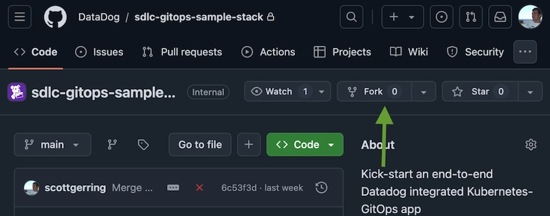
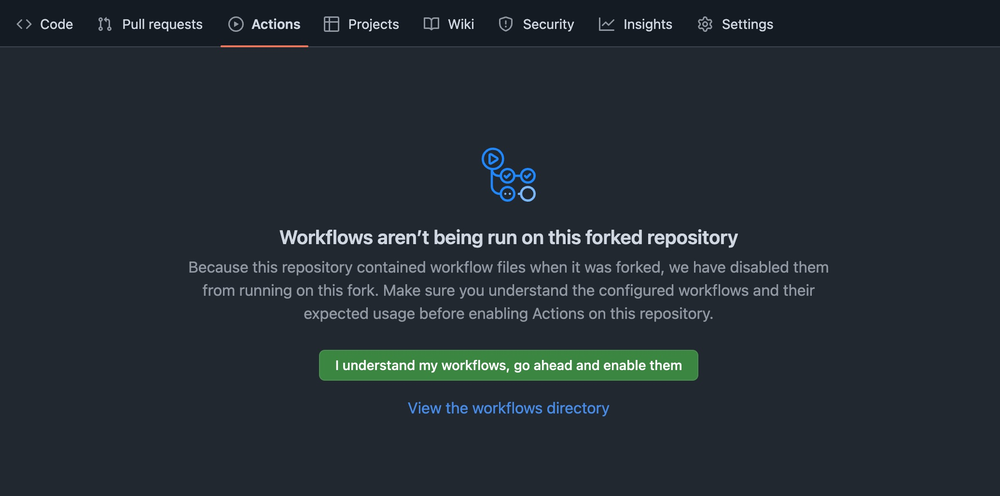

## Fork Repo

Fork this Repository [Datadog/sdlc-gitops-sample-stack](Datadog/sdlc-gitops-sample-stack) into your organisation or personal GitHub account. 

    

Visit the **Actions** tab of the fork. You will see that the workflows included in the repository have not been enabled. Enabling them will allow
the repository to build and release images, and is necessary for the GitOps process to work. If you've not used GitHub actions before, now is
a good time to [familiarise yourself with them](https://github.com/features/actions), and their [pricing model](https://docs.github.com/en/billing/managing-billing-for-your-products/managing-billing-for-github-actions/about-billing-for-github-actions). At the time of writing GitHub's Free plan
tier includes 2,000 minutes of action run per month!

Once you're happy to enable actions, enable actions:

    

Great! Now that we've got our own copy of the repository that can run workflows, 
we can move onto [integrating our project with Datadog](setup-github-integration.md).

