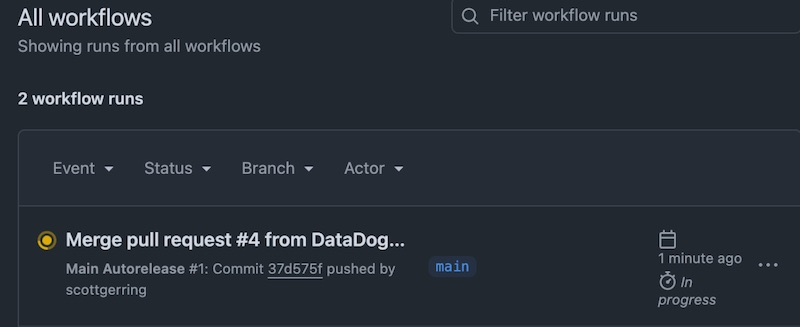
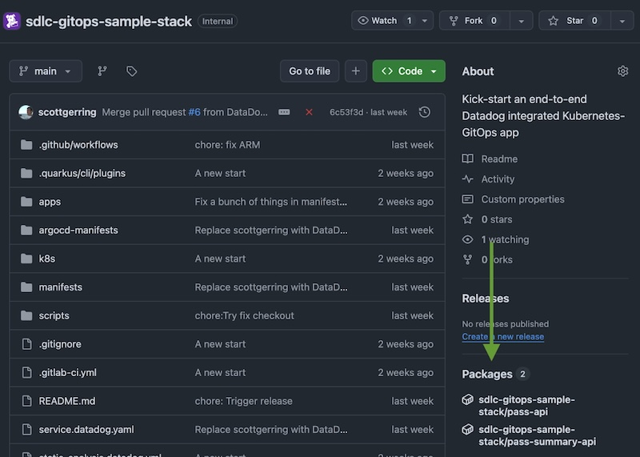

## Fork Repo

Fork this Repository [Datadog/sdlc-gitops-sample-stack](Datadog/sdlc-gitops-sample-stack) into your organisation or personal GitHub account. 

    

Visit the **Actions** tab of the fork. You will see that the main branch is being built. This will take roughly 10 minutes and will release the container images for the two services to your GitHub repository. 

    

Wait for the build to complete, then validate that the images produced are visible in the Packages section of the repository home: 

    

Great! Now we've got our own copy of the code and our container images built, we can move onto [integrating our project with Datadog](setup-github-integration.md).

