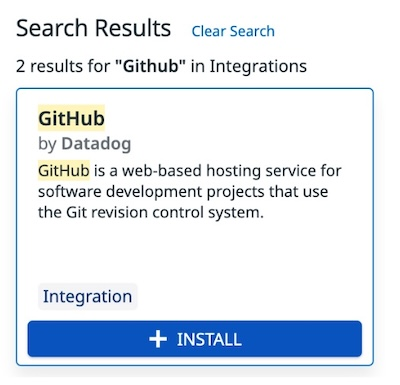
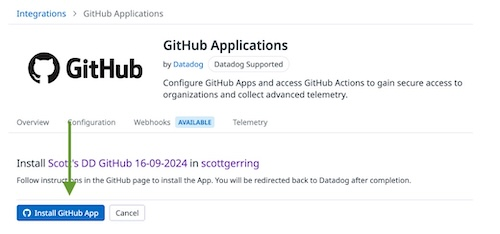
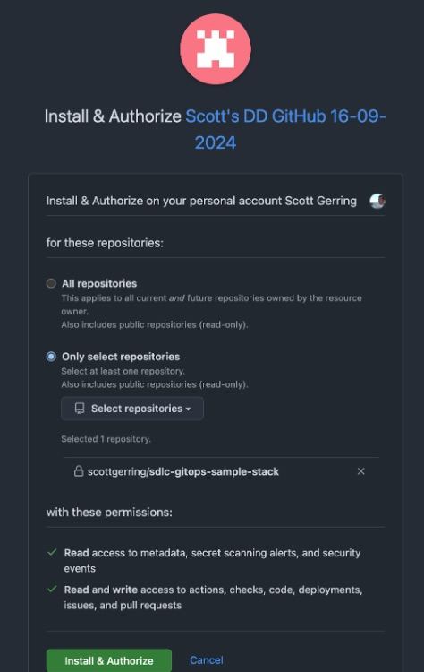

## Setup GitHub Integration

The **service catalogue**, **CI visibility** and **static analysis** integrations with Datadog all use Datadog’s GitHub integration to discover your code and build results - let’s set it up. In Datadog, Navigate to **Integrations** and search for GitHub. Select **Install**.

> [!TIP]
> Using cmd-k or ctrl-k within Datadog lets you jump around in the UI by naming where you want to go. 
> You can use this to get to **Integrations** and anywhere else this guide asks you to go to.

    

Select **Create Your First GitHub App** and fill out the form. Make sure to switch to “Personal Account” unless you’ve forked the repository into an organization. 

Enable all the features you would like to use. Everything in the list apart from _One-click terraform remediation_ can be used with this repository (we have no Terraform!). Please note that enabling all the things may have a cost impact outside of your free trial window.

Once you've added the app, select **Install GitHub App**, and install the app into the repository you forked earlier:

> [!TIP]
> If you think you are likely to add multiple repositories from GitHub, installing the Datadog application
> to the entire account or organization can simplify things in the future. On the other hand, if you'd prefer
> to control exactly what Datadog has access to, stick with explicitly installing it into each repository.

    

And then the GitHub half of the configuration:

    

Now that we've given Datadog access to our repository, let's [trigger a build](setup-trigger-initial-build.md) and see get some data into Datadog!
