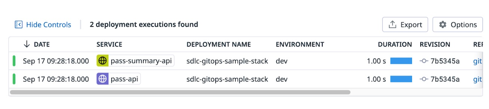

## Deploying the Mountain Passes Stack

Before we push the stack to our cluster with ArgoCD, we need to setup ArgoCD notifications to push deployment information back to Datadog.

The sample application includes [notifications.yaml](../argocd-manifests/base/notifications.yaml), which configures ArgoCD to notify Datadog of the status of deployments. As supplied, this applies to all applications deployed using ArgoCD in this cluster. For this to work you’ll need to [add your Datadog API key to ArgoCD’s secret](https://docs.datadoghq.com/continuous_delivery/deployments/argocd/#setup). 

### Trigger the deployment

To deploy the application, simply review and then apply the kustomize manifests from the [argocd-manifests directory](../argocd-manifests) to your cluster. These use the ArgoCD CRDs to setup and deploy the images from your repository. 

```bash  
# Deploy  
kubectl apply -k argocd-manifests

# List ArgoCD applications and deployed pods   
kubectl get applications -A  
kubectl get pods -n sdlc-gitops-sample-stack  
```

> [!IMPORTANT]
> if you’ve forked to a private repository, you’ll need to:
> * add docker secrets to your cluster to pull
> * add GitHub credentials to the ArgoCD UI to allow it to clone the repository

Wait for the stack to come up, and then forward a port to **pass-summary-api**: 

```bash
 kubectl port-forward svc/pass-summary-api 8080:8080 \-n sdlc-gitops-sample-stack
```

Then, in another shell:
```bash
curl http://localhost:8080/downstream
```
Which should return something like `{"total_ascent":6518,"pass_count":3}`

> [!TIP]
> [k9s](https://k9scli.io/) is a great terminal UI to work with Kubernetes clusters if you're looking for an alternative to `kubectl`.

The request here calls from the **pass-summary-api**, to the **pass-api**, which retrieves pass data from the database. This will result in log, trace and metric data being pushed to Datadog - let’s go have a look. 

### Find the deployment in Datadog

> [!TIP]
> Datadog Continuous Delivery (CD) Visibility provides observability on your deployments. 

Using the **Go To** dialog again, jump over to the **Executions** view from **CD Visibility**. Here you should immediately see the ArgoCD run that deployed the application into your cluster with each service broken out separately:

<p align='center'>
    
</p>

Clicking onto the deployment for one of the services, we can see what triggered the deployment, who pushed the commit, and the associated commit hash:

<p align='center'>
    
</p>

Clicking over to the **Service** tab shows us the metadata we provided earlier 
on for service ownership, and provides quick access to the logs/traces/metrics
associated with the deployment in our running environment.

Last of all - [let's go look at runtime visibility](setup-runtime-vis.md).
