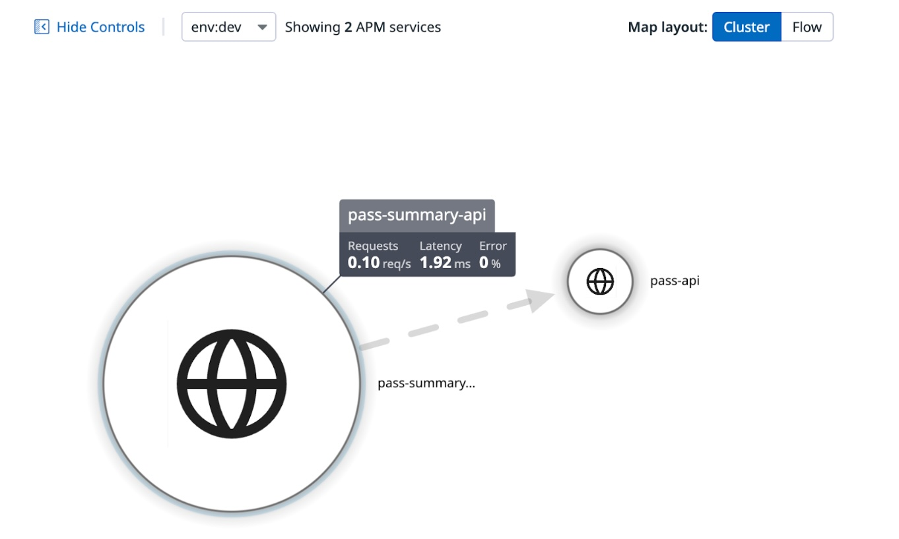
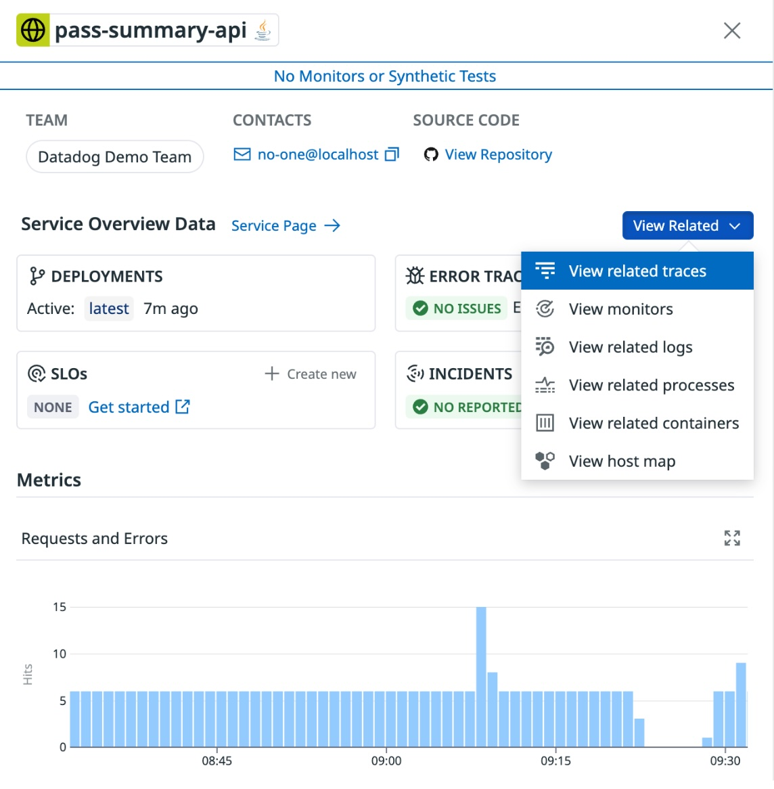
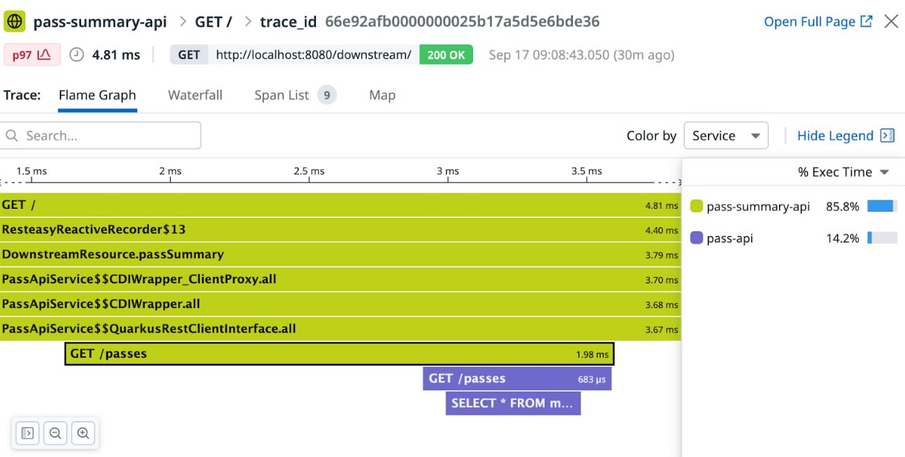

## Runtime Visibility

Runtime visibility from an _application_ perspective is provided by Datadog's
[Application Performance Monitoring(APM)](https://www.datadoghq.com/product/apm/) product. We'll focus on this perspective here, but it's important to note that because we're using the Datadog operator in our Kubernetes cluster, we have visibility all the way from the underlying machine up to our applications too.

### Logs / Traces / Metrics

If everything’s gone to plan you should now have all of your monitoring data propagated into Datadog. The easiest way to get started is by jumping over to **Service Map** and setting the **Environment** filter to **dev**; this should immediately highlight our two services:  

    

We can then “zoom in” on a service \- for instance, **pass-api-service**, by clicking the service and then **View Service Information**. From here, **View Related** lets us tie back to everything else we might need to understand our service \- for instance the traces, logs, the hosts the service is running on itself. 

    

Traces provide a particularly interesting view, as they let us see not only a flamegraph style breakdown of execution time of a particular request, but also correlate that back to the metrics and logs within the container and on the hosting machine over the same interval:

    

That's it! But there's still a lot more to discover - take some time to play around in the Datadog console, and in your Kubernetes cluster. Here's some ideas:

* Find some **profiles** from the running services in Datadog and see what the applications are spending their time on
* Cut a PR to your repository and watch the changes flow through the CI/CD pipelines and into your cluster after they are merged
* Setup some dashboards!

