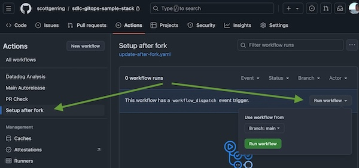
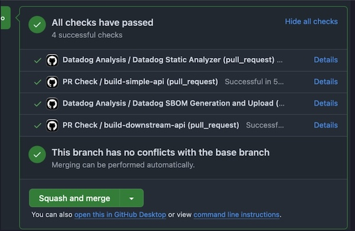
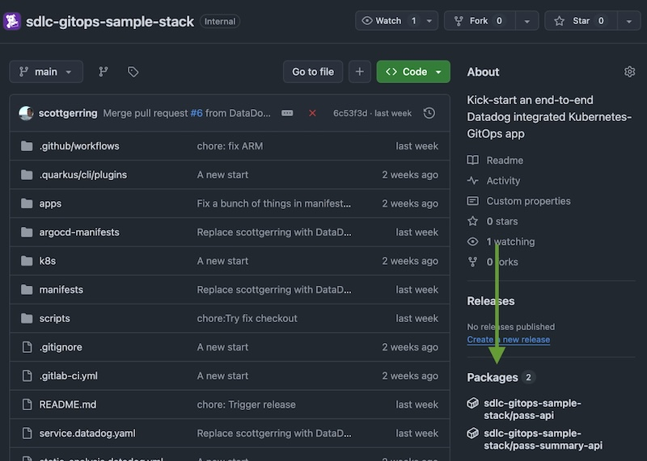

## Create a PR to trigger builds

Now that we have the integration between Datadog and GitHub setup, we can stage a PR to update our fork of the repository so it is deployable in ArgoCD. This will also trigger a set of builds, which will now show up in Datadog’s **CI Visibility** dashboard. 

Return to **GitHub**, go to **Actions**, and manually trigger the **Setup After Fork job**:

    

 This will create a branch on the repository with all the pieces referencing the current organization replaced with the location you've forked it to. Open a PR from the change. You should see the actions for the various checks fire off:

    

Review the changes. You should see that the action has updated references to the repository which previously pointed at **datadog/sdlc-gitops-sample-stack** to point to your fork. Concretely this means:

* the ArgoCD application itself in **argocd-manifests** will now point at your GitHub repository  
* the container images for pass-api and pass-summary-api in **manifests** will now point at your GitHub hosted container images 
* the `service.datadog.yaml` **Service Catalog** manifest, which points service documentation links back to your Github repository

> [!IMPORTANT]
> You should see no other changes outside of these files\! 

Once you have validated this and seen the builds complete, merge to main. This will trigger the main build jobs. 
Wait for the build to complete, then validate that the images produced are visible in the Packages section of the repository home: 

    

Next up we will jump over to the Datadog console where we should now be able to see the results of our build runs as well as the service definitions showing the services we'll be deploying. [Onwards!](setup-dev-lifecycle-visibility.md)